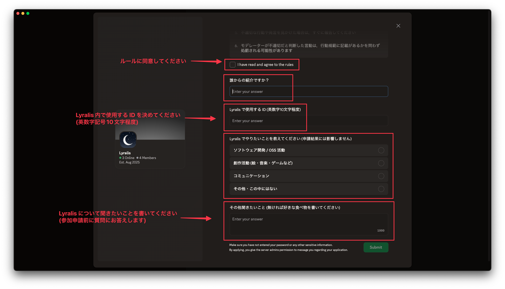

# Lyralis への参加方法

参加希望者はコミュニティメンバーからの招待(紹介)，または Discord クライアント内からの参加申請が必要です．

## 参加条件

- コミュニティのルールやガイドラインを遵守できること
- 他のメンバーと協力し，健全なコミュニティ活動に参加できること

## 参加方法

参加するにはコミュニティメンバーからの招待を受け，Discord クライアント内からの参加申請を行う必要があります．また最終的はコミュニティメンバーの承認が必要です．

### 注意事項

- **必ずしも参加申請が承認されるわけではありません**．
  - 参加申請が承認されない場合でも、理由の開示は行われませんので、あらかじめご了承ください。
- 参加時 Lyralis 内で使用する Cloud Identity の作成が必要です．最初に Prefix (識別子) を決めておいてください．なお，この Prefix は後から変更できません．

## 参加の流れ

1. 既に Lyralis に参加しているメンバーまたはオーナーのメールアドレス `me@m1sk9.dev` に参加希望の旨を連絡してください．
  - (メールの場合は) 参加希望の理由や自己紹介などを簡単に記載していただけると助かります．
  - 13歳以下の方は Discord の利用規約により参加できませんのでご了承ください．
2. [招待リンクを受け取ったら Discord クライアントから参加してください](https://support.discord.com/hc/ja/articles/360034842871)．
3. 必要な情報を入力し，申請を送信してください．

なお，参加申請には Discord の [サーバーメンバー申請](https://support.discord.com/hc/ja/articles/29729107418519-%E3%82%B5%E3%83%BC%E3%83%90%E3%83%BC%E3%83%A1%E3%83%B3%E3%83%90%E3%83%BC%E7%94%B3%E8%AB%8B#h_01JK8ZT53MQA698MX4Z2H1X56X) 機能を使用します．
